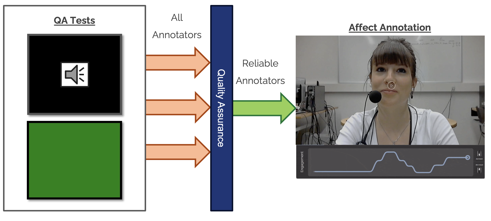
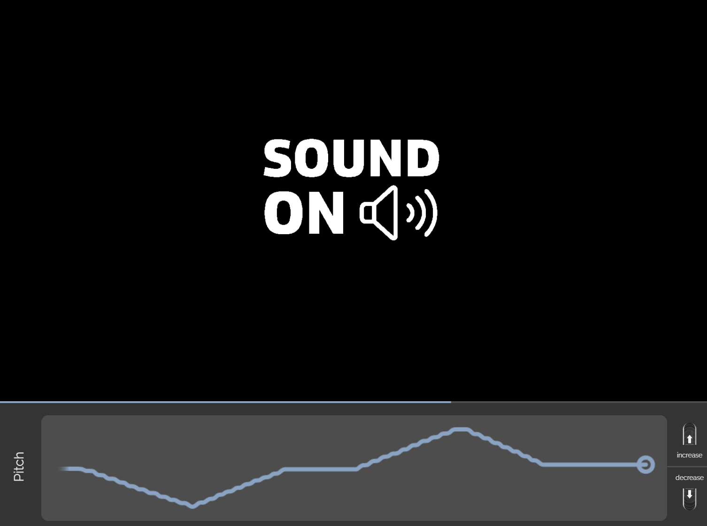
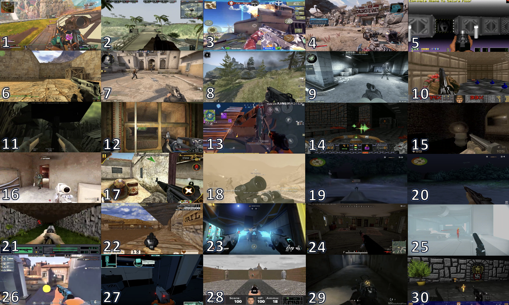

# PAGAN Quality Assurance Tools

Paper Link: https://arxiv.org/abs/2308.16029

Below we outline the two Quality Assurance (QA) tools we introduce for testing the reliability of annotators: one visual QA test and one auditory QA test. The QA tests are founded on the premise that the audio or visual content used as stimuli are (a) simple to annotate in terms of their labels, and (b) fully controlled by the researchers to provide an objective ground truth. The stimuli in both QA tests listed below are in video format, and are created within
the Processing environment (https://processing.org/). The videos, ground truth signal, and instructions on integrating these with PAGAN are included in this repository.

### Visual QA Test

Our first test in this QA toolkit consists of a purely visual task where the annotator is requested to annotate the change of brightness of a green screen. This must be set up as a standalone PAGAN session which is then linked to the Audio QA test once the participants complete the test. Before the test starts, the user is prompted with the following instructions: “Please use the scroll-wheel to indicate the changes in the level of brightness while watching the video”. The annotator uses a mouse wheel to scroll up or down to indicate the change of color brightness observed.

The 1-minute video (shown above) used as a stimulus has a predetermined pattern of brightness changes. The green color intensity value ranges between 25 and 255, and its fluctuation changes are controlled by the script that produces the video. The red and blue channels remain static at values of 20 and 12, respectively. This results in frames where the screen is dark and progressively more or less green, avoiding issues in perceptible brightness due the RGB file format. We carefully selected this test as its objective nature and low cognitive load allows us to effectively test the annotator’s ability to respond to visual stimuli and their response time.

### Audio QA Test

Based on the premise of the visual QA test, and due to the nature of audiovisual stimuli used in our game annotation task (see paper), we present the annotator with an auditory QA test. This test is also set up as a standalone PAGAN session, which once completed redirects the user to the final annotation task.

 The 1-minute video used as a stimulus for this task has no visual component (showing a black screen with a message, as shown above) and a monotonic audio signal with a dynamically changing pitch. The pitch ranges between 50 and 470 Hz, and the sound is produced by a triangle wave oscillator. Once again, the annotator is requested to use RankTrace and is prompted with the following instructions before the QA task: “Please use the scroll-wheel to indicate the changes in the level of Pitch while watching the video”.

This task is designed to test the annotator’s ability to react to purely aural stimuli, and to ensure that the annotator is using the proper setup to detect even low-pitch sounds heard in a video. We argue that these two tests, combined, cover both major types of audiovisual stimuli during the annotation process. Testing both types in isolation allows us to ensure the annotator’s reliability on both auditory and visual stimuli independently. 

## Dataset

For the purposes of this study we selected gameplay videos from 30 different and popular FPS games as elicitors of engagement. The choice of FPS games and videos was based on several criteria. First, we wish to ensure that these games cover a wide range of audiovisual stimuli for engagement annotation varying in graphical style (i.e. photo-realistic, retro, cartoon-like, etc.) and gameplay modes (i.e. battle royale, campaign, deathmatch, etc.). Second, we ensure there is no player or user commentary present in the video and that only the sound of the game can be heard during the video playback. Finally, we ensure that there is no video with more than 15 seconds of non-gameplay footage (e.g. menu screens, cut scenes or transition animations). The resulting game videos always have a duration of 1 minute. In order to provide annotators with a variety of stimuli, each session had 30 gameplay videos (one per FPS game) shown to the players in sequence. Session 1 includes therefore 30 videos in the form of a 30-minute sequential annotation task. Session 2 includes a different set of 30 gameplay videos (from the same 30 games shown in the image above).
